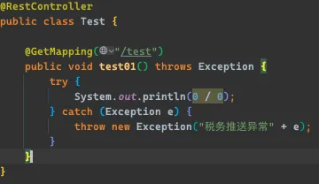
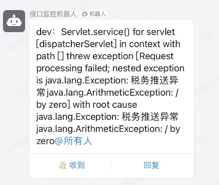

# 法克丁宝特
## 1.Maven集成

```xml
<dependency>
  <groupId>com.workplat</groupId>
  <artifactId>spring-boot-dingbot</artifactId>
  <version>1.0.0</version>
</dependency>
```

## 2.添加配置

```java
// 启动类上添加注解
@ComponentScan("com.workplat")
ding:
    bot-url: https://oapi.dingtalk.com/robot/send
    # 申请Key说明文档：https://open.dingtalk.com/document/robots/custom-robot-access
    bot-key: SECbeb6e12d2342dd17c453dc5bf64f01629b18f785a3b82bf4848cc1ed5e3f5cfd
    bot-token: a897325c3e067336b6a294a1b07255e5c12714bc9d5b98f16a90e4e94bfa5ae4
    # 是否开启集成logback(若无需集成 bot-enable以及trigger-words则不用配置)
    bot-enabled: true # 选填
    # 上报异常触发词
    trigger-words: # 选填
        - 税务推送异常
        - 财政接口异常
        - PDF文件生成失败
```

## 3.使用

### 3.1 整合logback实现异常触发自动上报

```xml
<!--配置自定义的日志处理了-->
<appender name="WlcLog" class="com.workplat.dingbot.configuration.CusLogLogbackAppender">
  <filter class="ch.qos.logback.classic.filter.LevelFilter">
    <level>ERROR</level>
    <onMatch>ACCEPT</onMatch>
    <onMismatch>DENY</onMismatch>
  </filter>
</appender>
<root level="info">
  <appender-ref ref="WlcLog"/>
</root>
```

在trigger-words中添加触发词，税务推送异常，则会自动发送钉钉消息





### 3.2 单独自定义使用dingbot

```java
@Autowired
private DingBotApi dingBotApi;
// or
DingBotApi dingBotApi = DingBean.getBean(DingBotApi.class);
```

DingBotApi接口说明

```java
public interface DingBotApi {

    /** 测试消息发送接口 */
    String sendMarkdownMsgTest(String botUrl, String botKey, String botToken, String content);
    String sendMarkdownMsgTest(String botUrl, String botKey, String botToken, String content, List<String> mobileList);

    /** 消息发送普通文本接口 */
    String sendTextMsg(String content);
    String sendTextMsg(String content, List<String> mobileList);

    /** 消息发送link类型文本接口 */
    String sendLinkMsg(String title, String content, String picUrl, String messageUrl);
    String sendLinkMsg(String title, String content, String picUrl, String messageUrl, List<String> mobileList);

    /** 消息发送markdown类型文本接口 */
    String sendMarkdownMsg(String title, String content);
    String sendMarkdownMsg(String title, String content, List<String> mobileList);

    /** 消息发送ActionCard类型文本接口 */
    String sendActionCardMsg(String title, String content, String singleURL);
    String sendActionCardMsg(String title, String content, String singleURL, List<String> mobileList);

    /** 消息发送FeedCard类型文本接口 */
    String sendFeedCardMsg(List<DingContent> dingContent);
    String sendFeedCardMsg(List<DingContent> dingContent, List<String> mobileList);
}
```
